# Architecture Diagram — ZSCL-MTIL + Replay + RTD

Styled after Figure 2 of Zheng et al., *"Preventing Zero-Shot Transfer Degradation in Continual Learning of Vision-Language Models"* (ICCV 2023). This project keeps ZSCL's teacher/student two-column layout intact and **adds** a replay buffer branch + a Replay Teacher Distillation (RTD) loss (highlighted as "new").

## Mermaid diagram

```mermaid
%%{init: {
  "theme": "base",
  "themeVariables": {
    "primaryColor": "#ffffff",
    "primaryTextColor": "#000000",
    "primaryBorderColor": "#555555",
    "lineColor": "#555555",
    "fontSize": "14px",
    "fontFamily": "Inter, Arial, sans-serif",
    "clusterBkg": "#fafafa",
    "clusterBorder": "#888888"
  },
  "flowchart": { "curve": "basis", "htmlLabels": true }
}}%%
flowchart TB
    %% ============================================================
    %% INPUTS
    %% ============================================================
    X_t["task batch<br/>(x_t, y_t)"]
    X_rep["replay buffer<br/>(x_rep, y_rep, task_id)"]
    X_ref["ref. images<br/>(ImageNet)"]
    T_ref["ref. texts<br/>(Conceptual Captions)"]
    T_task["task classnames<br/>(current + per-replay task)"]

    %% ============================================================
    %% FROZEN TEACHER θ₀
    %% ============================================================
    subgraph TCH[" frozen teacher θ₀ "]
        direction TB
        EI0["CLIP image enc.<br/>(frozen)"]
        ET0["CLIP text enc.<br/>(frozen)"]
    end

    X_ref --> EI0
    X_rep --> EI0
    T_ref --> ET0

    ET0 -. "cached" .-> g_ref0[("g_ref⁰<br/>CC text emb.")]
    EI0 --> f_ref0[("f_ref⁰<br/>teacher img emb, ImageNet")]
    EI0 --> f_rep0[("f_rep⁰<br/>teacher img emb, replay")]

    f_ref0 --> S0_ref["S⁰_ref<br/>(teacher sim. matrix)"]
    g_ref0 --> S0_ref
    f_rep0 --> S0_rep["S⁰_rep<br/>(teacher replay sim.)"]
    g_ref0 --> S0_rep

    %% ============================================================
    %% TRAINABLE STUDENT θ
    %% ============================================================
    subgraph STU[" trainable student θ "]
        direction TB
        EI["CLIP image enc.<br/>(student)"]
        ET["CLIP text enc.<br/>(student)"]
    end

    X_t  --> EI
    X_ref --> EI
    X_rep --> EI
    T_task --> ET

    EI --> f_t[("f_t<br/>student img emb, task")]
    EI --> f_ref[("f_ref<br/>student img emb, ImageNet")]
    EI --> f_rep[("f_rep<br/>student img emb, replay")]
    ET --> g_task[("g_task<br/>student task-text emb")]

    f_ref --> S_ref["S_ref<br/>(student sim. matrix)"]
    g_ref0 -. "frozen path" .-> S_ref
    f_rep --> S_rep["S_rep<br/>(student replay sim.)"]
    g_ref0 -. "frozen path" .-> S_rep

    %% Student-only similarity matrices for CE losses
    f_t    --> S_task["S_task"]
    g_task --> S_task
    f_rep  --> S_rsup["S_rsup"]
    g_task --> S_rsup

    %% ============================================================
    %% LOSSES
    %% ============================================================
    S_task --> L_ce["L_ce"]
    S_rsup --> L_rsup["L_rsup  (new)"]

    S0_ref -- "KL distill" --> L_zscl["L_zscl<br/>KL row+col"]
    S_ref  -- "KL distill" --> L_zscl
    S0_rep -- "KL distill" --> L_rtd["L_rtd  (new)<br/>KL row+col"]
    S_rep  -- "KL distill" --> L_rtd

    STU  -. "‖θ − θ₀‖²" .-> L_l2["L_l2"]
    TCH  -. "‖θ − θ₀‖²" .-> L_l2

    L_ce   --> L_total["L_total"]
    L_l2   --> L_total
    L_zscl --> L_total
    L_rsup --> L_total
    L_rtd  --> L_total

    %% ============================================================
    %% STYLING
    %% ============================================================
    classDef frozen fill:#e8e8e8,stroke:#666666,color:#000000
    classDef student fill:#d7ecff,stroke:#2563eb,color:#000000
    classDef loss fill:#fff3cd,stroke:#b08800,color:#000000
    classDef new fill:#ffd9b3,stroke:#d97706,color:#000000
    classDef data fill:#f5f5f5,stroke:#999999,color:#000000
    classDef emb fill:#ffffff,stroke:#999999,color:#000000

    class EI0 frozen
    class ET0 frozen
    class STU student
    class EI student
    class ET student
    class f_ref0 emb
    class f_rep0 emb
    class g_ref0 emb
    class S0_ref emb
    class S0_rep emb
    class f_t emb
    class f_ref emb
    class f_rep emb
    class g_task emb
    class S_ref emb
    class S_rep emb
    class S_task emb
    class S_rsup emb
    class L_ce loss
    class L_l2 loss
    class L_zscl loss
    class L_total loss
    class L_rsup new
    class L_rtd new
    class X_t data
    class X_rep data
    class X_ref data
    class T_ref data
    class T_task data
```



## Legend

- **Grey fill** (teacher θ₀, `f_*⁰`, `g_ref⁰`, `S⁰_*`) — frozen. Never receives gradient.
- **Blue fill** (student θ, `f_*`, `g_task`, `S_*`) — trainable in `whole` mode (image + text encoders + `logit_scale`).
- **Orange fill** (`L_rsup`, `L_rtd`) — **this project's contribution** (replay CE + Replay Teacher Distillation).
- **Yellow fill** (`L_ce`, `L_zscl`, `L_l2`, `L_total`) — existing ZSCL losses.
- Solid arrows = forward tensor flow. Dashed arrows = frozen / cached / regulariser.

## Reading the diagram

Per training iteration:

1. **Task batch** `(x_t, y_t)` → student image encoder + student text encoder over task classnames → `S_task` → **L_ce**.
2. **ImageNet ref images** → teacher + student image encoders. Both sides dot against **cached CC text embeddings** `g_ref⁰` (frozen teacher text encoder output, computed once). → `S⁰_ref`, `S_ref` → **KL distill (row + col)** → **L_zscl**.
3. **Replay batch** → teacher + student image encoders, same cached CC text embeddings → `S⁰_rep`, `S_rep` → **KL distill** → **L_rtd** *(new, Phase 3)*.
4. Same replay batch → student image encoder + student text encoder over each sample's own task classnames → `S_rsup` → **L_rsup** *(new)*.
5. **L2** between current student params and frozen init → **L_l2**.
6. Sum weighted → **L_total** → backward + SGD step + WiSE running-average every 50 iters.

## Why CC texts go only through the teacher

The student never processes `t_ref`. CC text embeddings `g_ref⁰` are computed once by the frozen teacher at init and cached (`trainer_phase3.py:329`). Both `S_ref` (student-side ZSCL matrix) and `S_rep` (student-side RTD matrix) dot student image embeddings against those cached teacher text embeddings. This is what makes the distillation a true fixed-target KD: the axis against which the student is compared never moves.

The student's text encoder is still trained — but only via `L_ce` and `L_rsup`, using task classnames (not CC).

## Output

The deliverable after the final task (SUN397) is the **WiSE-averaged student** `θ*` (saved as `SUN397.pth` in the v{N} checkpoint dir). Everything reported in `task_summary.csv` — Last, ImageNet avg, per-task accuracies — is measured from this single model.

## Component ↔ code map

| Diagram node | File:line |
|---|---|
| Frozen teacher θ₀ | `src/models/training.py:setup_zscl_reference_model` |
| Cached CC text emb. `g_ref⁰` | `trainer_phase3.py:329` (pre-loop computation) |
| ZSCL loss (`S⁰_ref` vs `S_ref`) | `src/models/training.py:compute_zscl_loss` (548) |
| RTD loss (`S⁰_rep` vs `S_rep`) | `phase3/losses_phase3.py:compute_replay_teacher_distill_loss` |
| Replay CE (`S_rsup`) | `src/models/training.py:compute_replay_loss` (765) |
| Task CE (`S_task`) | `src/models/training.py:compute_ce_loss` |
| L2 anchor | `src/models/helpers.py:l2_loss` |
| Replay buffer | `src/replay_buffer.py:ReplayBuffer` |
| WiSE running-average | `src/models/training.py:apply_weight_averaging` |

## Simplified thesis figure (ZSCL as a black box)

For the actual paper/thesis figure, treat ZSCL as a single cited block — your contribution is the replay branch + RTD + their interaction. This version expands the replay buffer internals, makes backprop explicit, and drops WiSE (mention it in the caption instead).

```
      ┌───────────────────┐        ┌──────────────────────────────────────────────────────┐
      │   Task t batch    │        │                   Replay Buffer                      │  ◀── YOUR CONTRIBUTION
      │   (x_t, y_t)      │        │                (budget B = 11,000)                   │
      └─────────┬─────────┘        │  ┌────────────────────────────────────────────────┐  │
                │                  │  │  per-task allocation:                          │  │
                │                  │  │     n_i = round( B · C_i / ΣC_j )              │  │
                │                  │  │  where C_i = # classes in task i               │  │
                │                  │  │  (target: ~9 exemplars per class)              │  │
                │                  │  │                                                │  │
                │                  │  │  Aircraft(100cls)→917    CIFAR100(100)→917     │  │
                │                  │  │  DTD(47)→431             EuroSAT(10)→92        │  │
                │                  │  │  SUN397(397)→3639        StanfordCars(196)→1797│  │
                │                  │  │  …                                             │  │
                │                  │  └────────────────────────────────────────────────┘  │
                │                  │    rebalance_proportional(·) after every new task    │
                │                  │    random sampler  → minibatch of 16                 │
                │                  │    each item carries (image, label, task_id)         │
                │                  └─────────────────┬────────────────────────────────────┘
                │                                    │
                ▼                                    ▼
      ┌──────────────────────────────────────────────────────────┐
      │                  Student CLIP  θ                         │
      │              (image + text encoders, trainable)          │
      └─────┬──────────┬──────────────┬────────────────┬─────────┘
            │          │              │                │
            │          │              │                │
            ▼          ▼              ▼                ▼
         L_ce    L_replay_sup       L_rtd           L_l2
           │          │               │               │
           │    (YOUR)│          (YOUR)│              │
           │          │               │               │
           │          │               │               │
           │          │      ┌────────┴─────────┐     │         ┌──────────────────┐
           │          │      │  teacher θ₀      │     │         │   ZSCL  [Zheng '23] │
           │          │      │  on replay × CC  │     │         │   ImageNet × CC   │
           │          │      │  (frozen, KD tgt)│     │         │   (frozen teacher │
           │          │      └──────────────────┘     │         │    as KD target)  │
           │          │                               │         └─────────┬────────┘
           │          │                               │                   │
           │          │                               │                   ▼
           │          │                               │               L_zscl
           │          │                               │                   │
           └──────────┴───────────────┬───────────────┴───────────────────┘
                                      │
                                      ▼
                                ┌─────────────┐
                                │   L_total   │
                                └──────┬──────┘
                                       │
                                       │    ∂L_total/∂θ
                                       │   (backprop)
                                       │
                     ┌─────────────────┘
                     │       ▲                                    ▲
                     │       │  ✗ no gradient to teacher θ₀       │
                     │       │  ✗ no gradient to buffer           │
                     ▼       │
              gradients into student θ only
                     │
                     ▼
            optimizer step  →  updated  θ*
                                       │
                                       ▼
                          (end of task t: add subset of task t's
                           data to replay buffer; rebalance;
                           move to task t+1)
```

### Reading the thesis figure

**Your contribution (the orange path):**
- Replay buffer (with structure: per-task slots, rebalancing, random sampling)
- `L_replay_sup` — supervised CE on past-task exemplars using each exemplar's own task classnames
- `L_rtd` — distillation between teacher and student on replay images (same CC-text axis ZSCL uses)

**Cited prior work (treated as one block):**
- ZSCL [Zheng et al., ICCV 2023] — contributes `L_zscl` from an ImageNet + CC reference pair

**Stability regulariser (cited from WiSE-FT line):**
- `L_l2` — `‖θ − θ_init‖²`

**Backprop:** `L_total` flows gradients into the student only. Teacher θ₀ is frozen; the buffer is a data store, not a parameter set. WiSE weight averaging is a training-loop detail — mention in caption, not in the figure.

### End-of-task bookkeeping (for the caption)

After each task *t* finishes:
1. Evaluate student on all 12 eval datasets (11 tasks + ImageNet), append row to `task_summary.csv`.
2. Sample `n_t = budget // (t+1)` exemplars from task *t*'s training data; add to buffer.
3. Rebalance buffer: downsample every prior task's slot to `n_t` as well (equal per-task allocation).
4. Proceed to task *t+1*.

After task 10 (SUN397), the final student checkpoint is the deliverable **θ\***. All metrics (Last, ImageNet avg) are computed from `task_summary.csv` *(Last = final row avg; ImageNet avg = ImageNet column averaged across all 11 rows)*.

## Current hyperparameters (v5)

- `L_total = L_ce + 1·L_l2 + L_zscl + 1.5·L_rsup + 0.3·L_rtd`
- Distillation temperature `T = 2`
- Replay buffer budget = 11,000 exemplars, equal per-task allocation
- Replay minibatch size = 16
- Learning rate = 5e-6, WiSE `avg_freq = 50`
- Base model = CLIP ViT-B/16 zero-shot
- Task order (MTIL 11-task): Aircraft → Caltech101 → CIFAR100 → DTD → EuroSAT → Flowers → Food → MNIST → OxfordPet → StanfordCars → SUN397
- ImageNet held out as zero-shot probe after every task.
