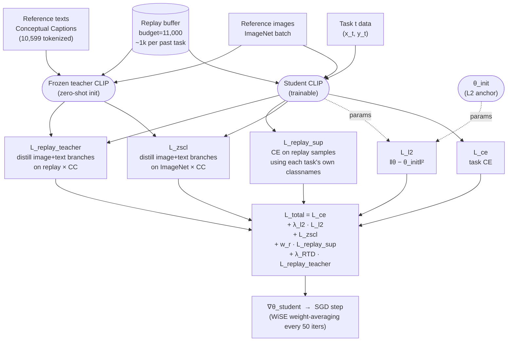

# ZSCL-MTIL + Replay — Method Diagram

Method run in this project: ZSCL (Zheng et al., *"Preventing Zero-Shot Transfer Degradation in Continual Learning of Vision-Language Models"*, ICCV 2023) extended with a **fixed-budget episodic replay buffer** and a **Replay Teacher Distillation (RTD)** loss (Phase 3).

Implementation: `mtil/phase3/trainer_phase3.py` (training loop), `mtil/phase3/losses_phase3.py` (RTD loss), `mtil/src/models/training.py` (shared ZSCL components), `mtil/src/replay_buffer.py` (buffer).

## One training iteration on task *t* (t ≥ 1)



## ASCII fallback

```
                    ┌─────────────────────────────────────┐
                    │  θ_init  ──(L2 anchor)──▶  L_l2     │
                    └─────────────────────────────────────┘
                                    │
  TASK t DATA ──▶ [Student] ──────────────▶ L_ce   (task CE)
                      ▲
                      │
  IMAGENET REF ──▶ [Student] ─┐
                              ├──▶ logits_student @ CC_text.T ─┐
                  [Teacher] ──┘                                ├─▶ L_zscl
                      ▲                                        │   (image + text
                      │                                        │    branches, KD)
                 CC TEXT (10,599) ──▶ [Teacher] ──▶ ref_emb ───┘

  REPLAY BUFFER ─▶ [Student] ─────────▶ per-task CE  ─────────▶ L_replay_sup
   (past tasks)
                 ──▶ [Student] ─┐
                                ├─▶ logits_student @ CC_text.T ─┐
                    [Teacher] ──┘                               ├─▶ L_replay_teacher
                                                                │   (Phase 3, RTD)
                                                                │
  L_total  =  L_ce  +  λ_l2·L_l2  +  L_zscl  +  w_r·L_replay_sup  +  λ_RTD·L_replay_teacher
                          ▲              ▲             ▲                ▲
                         l2=1         (weight 1     w_r=1.0         λ_RTD=0.3
                                     per branch)   (v5: 1.5)
```

## Component breakdown

| Term | What it protects against | Where in code | Current weight (v4/v5) |
|---|---|---|---|
| **L_ce** | Plasticity on current task | `compute_ce_loss` (training.py) | 1.0 |
| **L_l2** | Catastrophic drift from zero-shot init (protects ImageNet) | `l2_loss` (helpers.py) | λ_l2 = 1 |
| **L_zscl** | Zero-shot degradation on unseen classes (ImageNet-proxy) — distills teacher's alignment between ImageNet images and broad CC text space | `compute_zscl_loss` (training.py:548) | weight = 1 per sub-branch (image + text) |
| **L_replay_sup** | Forgetting on past tasks — supervised CE on stored exemplars, each classified with its own task's classnames | `compute_replay_loss` (training.py:765) | w_r = 1.0 (v5: 1.5) |
| **L_replay_teacher** | Representation drift on past-task images — KD to teacher's embedding of replay images against CC text space (Phase 3 addition) | `compute_replay_teacher_distill_loss` (losses_phase3.py) | λ_RTD = 0.3 |

## Why this specific combination

- **Plain fine-tuning** (just L_ce) → catastrophic forgetting of past tasks AND zero-shot degradation on unseen classes.
- **ZSCL alone** (L_ce + L_l2 + L_zscl, Zheng et al.) → preserves zero-shot (ImageNet) well, but past *trained* tasks still degrade because the ZSCL distillation uses ImageNet images, not past-task images.
- **+ Replay buffer** (add L_replay_sup) → gives a direct anti-forgetting signal on past-task data.
- **+ RTD** (add L_replay_teacher, this project's Phase 3 contribution) → on *the same* replay exemplars, also pulls the student toward the teacher's representation — protects the *structure* of past-task embeddings, not just the labels. The teacher is still the zero-shot init, so RTD simultaneously reinforces zero-shot alignment on real past-task images.

## Buffer management

- Budget: 11,000 exemplars total.
- Rebalanced after each new task: `budget // num_tasks_seen` per task.
- Random subsample (no reservoir needed — datasets are static).
- Stored on CPU as raw `(image_tensor, label, task_id)` tuples; moved to GPU per iteration.

## Weight averaging (WiSE-FT, orthogonal to the loss)

- Every `avg_freq = 50` iterations, an exponential running average of student weights is maintained (`we_model`).
- Final checkpoint = `we_model` rather than the last-step student. This smooths out noise from replay and CC mini-batches.

## Task order (11-task MTIL)

`Aircraft → Caltech101 → CIFAR100 → DTD → EuroSAT → Flowers → Food → MNIST → OxfordPet → StanfordCars → SUN397`

ImageNet is held out and evaluated zero-shot after every task (reported as `ImageNet avg` across all 11 evaluation rows).
